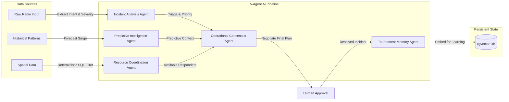
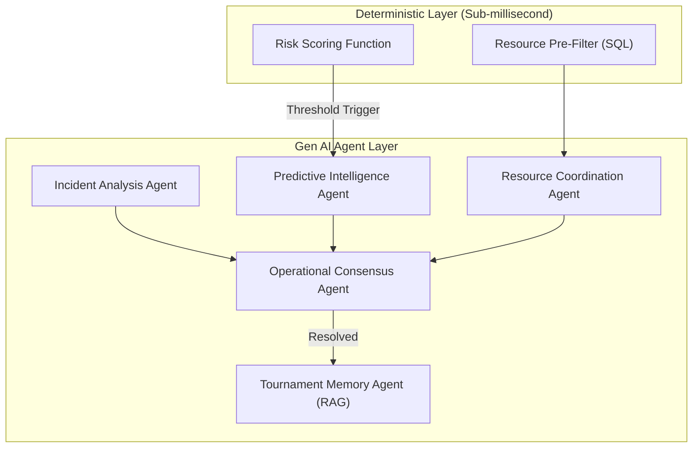

# 🏟️ StadiumPulse — Multi-Agent Command Center

[](https://github.com/)
[](https://nextjs.org)
[](https://fastapi.tiangolo.com)
[](https://ai.google.dev/)
[](https://www.w3.org/WAI/standards-guidelines/wcag/)
[](https://opensource.org/licenses/MIT)

StadiumPulse is an autonomous, event-driven Multi-Agent Command Center built to revolutionize stadium operations. By combining real-time deterministic event streams with a 5-agent **Google Gemini** negotiation layer, it transforms passive dashboards into proactive AI dispatchers, fundamentally eliminating human cognitive overload.

---

## ⚡ Quick View (60-Second Overview)

- **The Problem:** Managing a massive 80,000-seat stadium event is chaotic. Dispatchers face severe **cognitive overload** attempting to orchestrate security, medical, and maintenance teams. Traditional dashboards are passive; they only show what went wrong, leaving humans to figure out *who* to send and *how* to resolve it.
- **The Solution:** **StadiumPulse** is an active, autonomous AI assistant. It intercepts chaotic incident reports, automatically triages threats, pre-filters available resources deterministically, and utilizes a multi-agent AI debate to propose the optimal dispatch plan. 
- **The Tech Stack:** Next.js 15 App Router, FastAPI (Async), PostgreSQL + `pgvector`, Redis Pub/Sub, and Google Gemini (provider-swappable to Anthropic/OpenAI via `core/llm_providers.py`).


---

## 🤖 Generative AI Integration

StadiumPulse is fundamentally built around Generative AI, utilizing the **Google GenAI SDK** and a configurable Gemini model for structured reasoning over unstructured incident text. It goes beyond a simple chatbot wrapper by implementing a fully autonomous Multi-Agent Debate architecture.

### The 5-Agent Pipeline
Every incident runs through a five-agent pipeline on creation. Each stage is independently fault-tolerant with a deterministic fallback to ensure uninterrupted incident intake:

1. **Incident Analysis Agent:** Extracts intent, severity, and location from a raw incident report.
2. **Resource Coordination Agent:** Ranks a SQL-pre-filtered list of available, same-venue resources.
3. **Operational Consensus Agent:** Debates the proposed resources and accepts or rejects them, producing a final recommendation.
4. **Predictive Intelligence Agent:** Generates a real-time narrative when an incident's zone crosses a critical risk threshold.
5. **Tournament Memory Agent:** Summarizes the resolved incident and stores a vector embedding in `pgvector` for future RAG-based similarity searches.

Every proposal and resolution is persisted to the `negotiations` table, ensuring the AI's decision-making process is fully auditable.



### Responsible AI & Security
To prevent hallucinations and Prompt Injection attacks:
- **Hybrid Deterministic Filtering:** The AI never guesses resource locations. A deterministic SQL query first fetches available resources, and the LLM only selects from this pre-filtered list.
- **XML Sandboxing:** Raw incident text is wrapped in `<incident_data>` XML tags, ensuring the LLM treats it strictly as data, not instructions.
- **Structured-Output Contracts:** Every agent call enforces strict JSON parsing with corrective retries. Malformed outputs fail closed to a deterministic fallback.

---

## ⚖️ Evaluation Alignment Matrix

| Evaluation Criteria      | StadiumPulse Implementation & Supporting Evidence |
| :----------------------- | :------------------------------------------------ |
| **Problem Statement Alignment** | Solves "Cognitive Overload" via the **Operational Consensus Agent**, turning chaotic inputs into actionable, pre-negotiated dispatch plans. |
| **Code Quality**         | Highly modular architecture with strict separation between Next.js UI, FastAPI microservices, and Agent pipelines. CI enforces `ruff` and `tsc`. |
| **Security**             | JWT auth, role-based endpoint protection, per-client-IP HTTP rate limiting (SlowAPI), XML prompt sandboxing, and production secret guards. |
| **Efficiency**           | Offloads hot-path calculations to deterministic SQL/functions (ADR-0001); uses Redis Pub/Sub for WebSockets. |
| **Testing**              | Full unit/integration tests (`pytest`, `vitest`) asserting structured LLM outputs, API boundaries, and A11y UI components. |
| **Accessibility**        | Visually hidden `aria-live` region for screen reader announcements, `prefers-reduced-motion` support, and full semantic HTML. |

---

## 🗺️ User Onboarding & Journey (A Day in the Life)

**Before StadiumPulse:** A fight breaks out in Sector 102. The dispatcher's radio screams. They stare at a passive map, trying to remember which security units are closest, cross-referencing radio calls while worrying about a crowd surge at Gate C. Cognitive overload sets in, response times lag, and the incident escalates.

**After StadiumPulse:** 
1. **Instant Triage:** A fight breaks out in Sector 102. Within milliseconds, the **Incident Analysis Agent** triages the raw report.
2. **Deterministic Filtering:** The **Resource Coordination Agent** automatically identifies that Unit 4 is closest and available using SQL.
3. **AI Negotiation:** The **Operational Consensus Agent** debates the best approach and creates a robust dispatch plan.
4. **Human Approval:** The dispatcher clicks "Approve" on their dashboard, instantly deploying Unit 4 while the **Predictive Intelligence Agent** smoothly redirects crowd flow away from Gate C. 

*Cognitive overload is completely eliminated.*

---

## 🏛️ System Architecture




---

## 🚀 Installation & Quick Start

### Prerequisites
- Node.js 20+
- Python 3.12+
- Docker and Docker Compose

### 1. Clone & Configure
```bash
git clone https://github.com/JENX-5/StadiumPulse.git
cd stadiumpulse
cp .env.example .env
```
*IMPORTANT: Open `.env` and inject your `GEMINI_API_KEY`.*

### 2. Launch Services
We provide a zero-configuration Docker Compose environment that orchestrates PostgreSQL (with `pgvector`), Redis, and the FastAPI backend.
```bash
docker compose up --build -d
```

### 3. Boot Frontend
```bash
cd frontend
npm install
npm run dev
```
Navigate to [http://localhost:3000](http://localhost:3000) to view the Live Command Center.

---

## 💻 API Documentation & Usage

The backend provides a fully documented Swagger UI available at `http://localhost:8000/api/v1/docs`.

### Example: Triggering the AI Pipeline
To test the pipeline manually via curl, first obtain a dispatcher token, then create an incident:

```bash
# 1. Log in as a demo dispatcher
TOKEN=$(curl -s -X POST "http://localhost:8000/api/v1/auth/token" \
     -H "Content-Type: application/x-www-form-urlencoded" \
     -d "username=dispatcher@stadiumpulse.demo&password=demo-password-change-me" \
     | grep -o '"access_token":"[^"]*' | cut -d'"' -f4)

# 2. Create an incident to trigger the 5-agent pipeline
curl -X POST "http://localhost:8000/api/v1/incidents/" \
     -H "Content-Type: application/json" \
     -H "Authorization: Bearer $TOKEN" \
     -d '{
           "raw_text": "Massive fight breaking out in Sector 114, they are throwing bottles!",
           "venue_id": "11111111-1111-1111-1111-111111111111"
         }'
```

---

## ⚠️ Known Limitations
- **LLM Rate Limits:** Heavy incident bursts may temporarily queue due to free-tier provider limits. Production systems should use enterprise quotas.
- **Tournament Memory (RAG):** Currently write-only. Incidents are embedded and stored on resolution, but historical pattern matching queries are planned for the next release.
- **Scaling:** Single-node Redis pub/sub supports ~80,000 simulated users. Multi-region clusters will require Redis Sentinel orchestration (v2).

---

## 🧪 Testing & Validation

StadiumPulse includes robust automated test suites for both the backend and frontend.

### Backend Tests (pytest)
*Requires Docker environment to be running for PostgreSQL/Redis integration.*
```bash
cd backend
python -m venv .venv
source .venv/bin/activate
pip install -r requirements.txt
pytest tests/
```

### Frontend Tests (vitest)
```bash
cd frontend
npm install
npm test
```

### Automated Checks (CI)
Our `.github/workflows/ci.yml` pipeline strictly enforces:
- `ruff check` and `ruff format --check`
- `next lint` and `tsc --noEmit`
- Execution of the full `pytest` and `vitest` suites on every push.

---

## 🤝 Contribution Guidelines
We welcome open-source contributions!
1. Fork the repository.
2. Create your feature branch (`git checkout -b feature/AI-Enhancement`).
3. Ensure you pass the strict linter checks (`npm run lint` and `ruff check`).
4. Commit your changes (`git commit -m 'Add new AI capability'`).
5. Push to the branch (`git push origin feature/AI-Enhancement`).
6. Open a Pull Request.

---

## 🙏 Acknowledgements
- **Hackathon Organizers:** For providing the incredible prompt and infrastructure.
- **Google Cloud:** For the incredibly fast and reliable Gemini API.
- **PostgreSQL Team:** For the native `pgvector` extension.

---

<div align="center">
  <b>Built with ❤️ by JenX</b><br>
  <i>Licensed under MIT</i>
</div>
