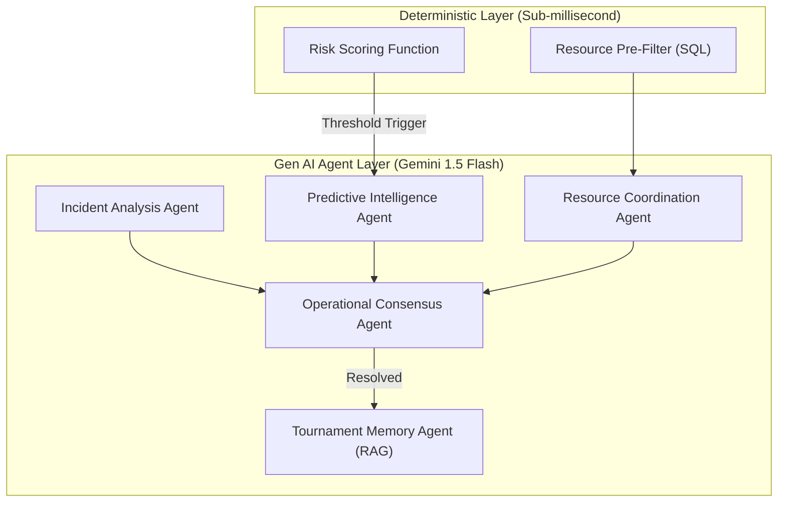

<div align="center">
  <h1>🏟️ StadiumPulse</h1>
  <p><em>Autonomous, Event-Driven Multi-Agent Command Center for Stadium Operations</em></p>

  [](https://opensource.org/licenses/MIT)
  [](https://python.org)
  [](https://fastapi.tiangolo.com)
  [](https://nextjs.org)
  [](https://postgresql.org)
  [](https://ai.google.dev/)
</div>

<br />

> **The ultimate command center combining real-time deterministic event streams with a 5-agent Google Gemini negotiation layer.**

## 📑 Table of Contents
- [🏆 The Problem](#-the-problem)
- [💡 The Solution](#-the-solution)
- [🤖 Multi-Agent Gen AI (Powered by Gemini)](#-multi-agent-gen-ai-powered-by-gemini)
- [✨ Core Features](#-core-features)
- [🏗 Architecture & Design](#-architecture--design)
- [🛠 Tech Stack](#-tech-stack)
- [🚀 Quickstart (Zero-Config)](#-quickstart-zero-config)
- [🧪 Testing](#-testing)
- [🔮 Future Work](#-future-work)

---

## 🏆 The Problem
Managing a massive 80,000-seat stadium event is chaos. Dispatchers face **severe cognitive overload** attempting to orchestrate security, medical, and maintenance teams during rapidly evolving incidents. Traditional dashboards are passive; they only show what went wrong, leaving humans to figure out *who* to send and *how* to resolve it.

## 💡 The Solution
**StadiumPulse** transforms the passive dashboard into an **active, autonomous AI assistant**. 

Instead of wrapping a single LLM prompt, StadiumPulse utilizes a complex **Multi-Agent Orchestration Engine powered by Google Gemini**. When an incident occurs, five specialized agents analyze the situation, pre-filter available resources via deterministic SQL queries (to save AI tokens and latency), and then literally *debate* the best response. Human operators monitor the live AI negotiation on a stunning real-time dashboard and approve the final consensus.

<div align="center">
  
</div>

---

## 🤖 Multi-Agent Gen AI (Powered by Gemini)
StadiumPulse deeply integrates Gen AI by utilizing **Google Gemini 1.5 Flash** via the brand new `google-genai` SDK across five distinct agent personas. The AI is highly meaningful, directly controlling the resource coordination logic and utilizing Gemini's native structured JSON responses for ultimate reliability.

1. 🧠 **Predictive Intelligence Agent:** Constantly evaluates stadium risk scores and generates predictive threat narratives.
2. 🚨 **Incident Analysis Agent:** Instantly classifies, triages, and prioritizes raw chaotic incident reports.
3. 🚁 **Resource Coordination Agent:** Proposes the most optimal dispatch from a deterministically pre-filtered `pgvector` shortlist.
4. ⚖️ **Operational Consensus Agent:** The "Manager". It reviews proposals, resolves conflicts, and finalizes the deployment plan.
5. 📚 **Tournament Memory Agent:** Asynchronously embeds the resolved incident into a vector database to continuously improve future AI responses.

> **Transparency:** All AI internal "scratchpad" thoughts and debates are streamed to the frontend via WebSockets, completely eliminating the "AI Black Box" problem.

---

## ✨ Core Features
- **Real-Time Agent Negotiation:** Watch AI agents debate and resolve incidents live on the Timeline.
- **Hybrid Deterministic/Gen-AI Engine:** Drastically reduces LLM hallucination and latency by using SQL and Redis to pre-filter context before invoking the LLM.
- **Vector-Backed Memory:** Uses `pgvector` for true Semantic Search and RAG over past incidents.
- **Production-Ready Dashboard:** A Next.js + Zustand application featuring Framer Motion micro-animations, semantic HTML, and live WebSockets.
- **Enterprise Security:** bcrypt hashing, JWT authentication, and explicit CORS configurations.

---

## 🏗 Architecture & Design



*For an in-depth look at the engineering choices, please read the [Architecture Decision Records (ADRs)](./docs/decisions/).*

---

## 🛠 Tech Stack

| Domain | Technologies Used |
|---|---|
| **Backend API** | Python 3.11, FastAPI, SQLAlchemy 2.0 (Async), Alembic, Pydantic |
| **Database & Vector Store** | PostgreSQL 16 + `pgvector` |
| **Event Bus & Cache** | Redis (Pub/Sub) |
| **Gen AI** | Google Gemini (via `google-genai` SDK) |
| **Frontend UI** | Next.js 15 (App Router), React 18, Tailwind CSS, Zustand, Framer Motion |
| **Infrastructure** | Docker, Docker Compose |

---

## 🚀 Quickstart (Zero-Config)

You can spin up the entire multi-agent platform, database, and frontend locally with one command.

1. **Clone & Configure:**
   ```bash
   git clone https://github.com/JENX-5/StadiumPulse.git
   cd stadiumpulse
   cp .env.example .env
   # Open .env and add your GEMINI_API_KEY
   ```

2. **Launch with Docker:**
   ```bash
   docker compose up --build
   ```

3. **View the Magic:**
   - **Live Command Center:** [http://localhost:3000](http://localhost:3000)
   - **Backend API (Swagger):** [http://localhost:8000/api/v1/docs](http://localhost:8000/api/v1/docs)

---

## 🎮 How to Use the Simulation

Once the application is running, you can interact with the dashboard to inject incidents and watch the multi-agent system resolve them in real-time.

1. **Open the Mission Control Dashboard:** Navigate to [http://localhost:3000](http://localhost:3000) in your browser.
2. **Access the Simulation Panel:** On the right side of the dashboard, click on the **AI & Sim** tab.
3. **Inject an Incident:** 
   - Scroll down to the **Inject Incident** section.
   - Select a **Zone** from the dropdown (e.g., Sector 102, West Concourse).
   - Enter a **Description** of the event (e.g., "Medical emergency in Sector 102" or "Suspicious package near Gate A").
   - Click **Inject Incident**.
4. **Watch the AI Negotiation:** The newly injected incident will appear on the live timeline on the left. The system will automatically trigger the agents (Incident Analysis, Resource Coordination, and Operational Consensus) to analyze the threat, debate, and dispatch resources.
5. **Verify the Resolution:** Observe the assigned resources and the final operational consensus reached by the AI in the incident details.

*Alternatively, you can programmatically inject incidents via the Swagger UI by sending a `POST` request to the `/api/v1/incidents/` endpoint.*

---

## 🧪 Testing

StadiumPulse is built to be robust and is heavily tested.

**Backend (69+ Pytest Unit Tests):**
```bash
cd backend
source .venv/bin/activate
pytest tests/ -v
```

**Frontend (Vitest Store & Component Logic):**
```bash
cd frontend
npm install
npm run test
```

---

## 🔮 Future Work
- **Live Camera Feed AI:** Integrating multimodal capabilities (like Gemini's powerful vision models) to automatically detect incidents from stadium CCTV video streams.
- **Responder Mobile App:** A React Native client for on-the-ground staff to receive AI dispatches and update status.
- **Full RBAC:** Advanced role-based access control for different stadium authorities (Police, Medical, Maintenance).

---

<div align="center">
  <b>Built with ❤️ by JenX</b>
</div>
