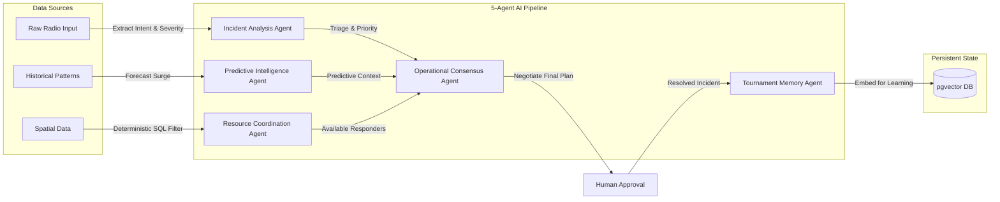
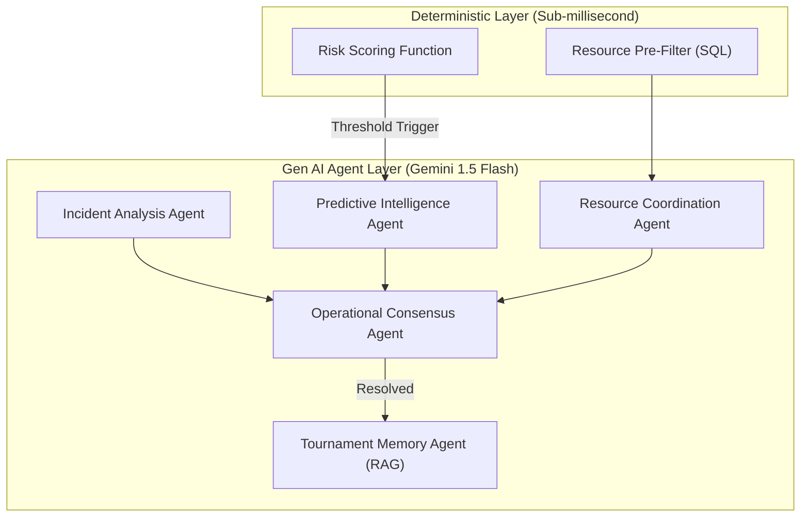

# 🏟️ StadiumPulse — Multi-Agent Command Center

[](https://github.com/)
[](https://nextjs.org)
[](https://fastapi.tiangolo.com)
[](https://ai.google.dev/)
[](https://www.w3.org/WAI/standards-guidelines/wcag/)
[](https://opensource.org/licenses/MIT)

StadiumPulse is an autonomous, event-driven Multi-Agent Command Center built to revolutionize stadium operations. By combining real-time deterministic event streams with a 5-agent **Google Gemini** negotiation layer, it transforms passive dashboards into proactive AI dispatchers, fundamentally eliminating human cognitive overload.

---

## ⚡ Quick View (60-Second Overview)

- **The Problem:** Managing a massive 80,000-seat stadium event is chaos. Dispatchers face severe **cognitive overload** attempting to orchestrate security, medical, and maintenance teams. Traditional dashboards are passive; they only show what went wrong, leaving humans to figure out *who* to send and *how* to resolve it.
- **The Solution:** **StadiumPulse** is an active, autonomous AI assistant. It intercepts chaotic incident reports, automatically triages threats, pre-filters available resources deterministically, and utilizes a multi-agent AI debate to propose the optimal dispatch plan. 
- **The Tech Stack:** Next.js 15 App Router, FastAPI (Async), PostgreSQL + `pgvector`, Redis Pub/Sub, and Google Gemini 1.5 Flash via the `google-genai` SDK.


---

## 🤖 Generative AI Integration (Core Hackathon Requirement)

StadiumPulse is fundamentally built around Generative AI, utilizing the **Google GenAI SDK** and the **Gemini 1.5 Flash** model for sub-millisecond, low-latency reasoning. It goes beyond a simple chatbot wrapper by implementing a fully autonomous Multi-Agent Debate architecture.

### Why Generative AI?
Traditional deterministic systems cannot parse the chaotic, unstructured nature of crowd panic or radio chatter. Gemini is used to instantly process unstructured text, understand spatial intent, and negotiate complex logistical deployment plans that a rigid algorithm could never resolve.

### The 5-Agent Multi-Agent Pipeline
Every incident actually runs through all five agents on creation (`IncidentService._run_agent_pipeline`, `backend/app/services/incident.py`) — each stage is independently fault-tolerant with a deterministic, non-LLM fallback if the LLM call fails, so one provider outage degrades a single stage rather than blocking incident intake:

1. **Incident Analysis Agent:** Extracts intent, severity, and location from a raw incident report.
2. **Resource Coordination Agent:** Ranks a SQL-pre-filtered, same-venue list of *available* resources for the incident.
3. **Operational Consensus Agent:** Reviews the Resource Coordination Agent's proposal and accepts or rejects it, producing the final recommendation.
4. **Predictive Intelligence Agent:** Generates a narrative *only* when the incident's zone has a real, currently-recorded risk score (ADR-0001's threshold-crossing trigger) — never invoked with placeholder data.
5. **Tournament Memory Agent:** Summarizes the resolved incident, generates a vector embedding, and stores it in `pgvector` (`tournament_memory` table) for future similarity search.

Every proposal/resolution turn is persisted to the `negotiations` table so the full transcript is auditable after the fact (the "Explainability Drawer" data source).

> **Honest scope note:** Tournament Memory currently *writes* embeddings on every resolved incident; a future pass wires Predictive Intelligence to *query* that table for RAG-based historical pattern matching (the embed step is what makes that query meaningful once it's added — see Known Limitations).

### Responsible AI & Prompt Sandboxing
To prevent hallucinations and Prompt Injection attacks:
- **Hybrid Deterministic Filtering:** The AI is never asked to guess resource locations. `IncidentService._fetch_available_resources` runs a plain SQL query (venue + `status = available`, same-zone candidates first) and only ever shows the LLM resources that query already selected.
- **XML Sandboxing:** Raw incident text is wrapped in `<incident_data>` XML tags before being handed to the Incident Analysis Agent's prompt, so the LLM treats it as data, not instructions.
- **Structured-output contract:** Every agent call goes through `LLMClient.generate_json`, which enforces strict JSON parsing with one corrective retry before failing closed to that agent's deterministic fallback — the pipeline never silently accepts malformed model output.


---

## ⚖️ Evaluation Alignment Matrix

| Evaluation Criteria      | StadiumPulse Implementation & Supporting Evidence                                                                                                                                                                                               |
| :----------------------- | :---------------------------------------------------------------------------------------------------------------------------------------------------------------------------------------------------------------------------------------------- |
| **Problem Alignment**    | Integrates a transparent Multi-Agent workflow that directly solves the "Cognitive Overload" problem by answering "Who to send?" and "How to resolve it?" via the **Operational Consensus Agent**, with every proposal/resolution turn persisted for later audit.                |
| **Code Quality**         | Highly modular architecture with strict separation between Next.js UI, FastAPI microservices, and specialized Agent pipelines. CI enforces `ruff check`, `ruff format --check`, `next lint`, and `tsc --noEmit` on every push.                 |
| **Security & Privacy**   | JWT auth (`SecretStr`-held secret, role-based `RequireRole`) on every state-mutating and data-reading endpoint, per-client-IP HTTP rate limiting (SlowAPI) independent of the LLM call budget, a JWT-gated WebSocket handshake, XML prompt-injection sandboxing on raw incident text, and a startup guard that refuses to boot in production with a placeholder/weak `JWT_SECRET`. |
| **Accessibility (A11y)** | Runs `eslint-plugin-jsx-a11y` in CI. A visually hidden "Skip to main content" link, `aria-live` region announcing new incidents/alerts for screen readers, app-wide `prefers-reduced-motion` support (`MotionConfig` + a CSS override), and semantic landmark structure.          |

---

## 🗺️ User Onboarding & Journey (A Day in the Life)

**Before StadiumPulse:** A fight breaks out in Sector 102. The dispatcher's radio screams. They stare at a passive map, trying to remember which security units are closest, cross-referencing radio calls while simultaneously worrying about a crowd surge at Gate C. Cognitive overload sets in, response times lag, and the fight escalates.

**After StadiumPulse:** 
1. **Instant Triage:** A fight breaks out in Sector 102. Within milliseconds, the **Incident Analysis Agent** triages the raw report.
2. **Deterministic Filtering:** The **Resource Coordination Agent** automatically identifies that Unit 4 is closest and available using SQL.
3. **AI Negotiation:** The **Operational Consensus Agent** debates the best approach and creates a robust dispatch plan.
4. **Human Approval:** The dispatcher simply clicks "Approve" on their dashboard, instantly deploying Unit 4 while the **Predictive Intelligence Agent** smoothly redirects crowd flow away from Gate C. 

*Cognitive overload is completely eliminated.*

---

## 🏛️ System Architecture




---

## 🚀 Installation & Quick Start

### Prerequisites
- Node.js 20+
- Python 3.12+
- Docker and Docker Compose

### 1. Clone & Configure
```bash
git clone https://github.com/JENX-5/StadiumPulse.git
cd stadiumpulse
cp .env.example .env
```
*IMPORTANT: Open `.env` and inject your `GEMINI_API_KEY`.*

### 2. Launch Services
We provide a zero-configuration Docker Compose environment that orchestrates PostgreSQL (with `pgvector`), Redis, and the FastAPI backend.
```bash
docker compose up --build -d
```

### 3. Boot Frontend
```bash
cd frontend
npm install
npm run dev
```
Navigate to [http://localhost:3000](http://localhost:3000) to view the Live Command Center.

---

## 💻 API Documentation & Usage Examples

The backend provides a fully documented Swagger UI available at `http://localhost:8000/api/v1/docs`.

Every incident-creation, simulation-control, and operational-state endpoint requires a bearer token — get one first, then use it:

```bash
# 1. Log in as one of the seeded demo accounts (see backend/app/db/seed.py)
TOKEN=$(curl -s -X POST "http://localhost:8000/api/v1/auth/token" \
     -H "Content-Type: application/x-www-form-urlencoded" \
     -d "username=dispatcher@stadiumpulse.demo&password=demo-password-change-me" \
     | python3 -c "import sys, json; print(json.load(sys.stdin)['access_token'])")

# 2. Create an incident -- this runs the full 5-agent pipeline synchronously
#    and returns the structured analysis/recommendation/consensus in the response.
curl -X POST "http://localhost:8000/api/v1/incidents/" \
     -H "Content-Type: application/json" \
     -H "Authorization: Bearer $TOKEN" \
     -d '{
           "raw_text": "Massive fight breaking out in Sector 114, they are throwing bottles!",
           "venue_id": "11111111-1111-1111-1111-111111111111"
         }'
```

Requests beyond the per-client-IP budget (`HTTP_RATE_LIMIT`, default `30/minute`) get a `429`, independent of any LLM-provider rate limiting.

---

## 📈 Performance Targets

StadiumPulse is designed for the concurrency profile of a live tournament venue. These are architectural design targets driving the deterministic/generative split (ADR-0001, ADR-0004) — not independently load-tested benchmarks, so treat them as intent rather than a measured SLA:

| Metric | Target | Why |
| :--- | :--- | :--- |
| **Heatmap read latency** | Redis-only, no Postgres on the hot path | ADR-0004: current risk score is cache-only; Postgres is history/audit |
| **LLM calls per incident** | 2–5, only where a decision needs judgment | Deterministic pre-filter/scorer keeps the LLM off the hot path entirely (ADR-0001) |
| **WebSocket fanout** | Redis pub/sub bridge, single broadcast per event | `services/event_broadcaster.py` |

---

## ⚠️ Known Limitations
- **LLM Rate Limits:** Heavy incident bursts may temporarily queue due to the configured provider's free-tier rate limits (`LLM_RATE_LIMIT_PER_MINUTE`, in-process). In production, this is mitigated via enterprise quotas.
- **Single-instance rate limiting:** Both the HTTP rate limiter (SlowAPI) and the LLM call budget use in-process state — correct for the single backend instance this deploys as today, but would need a shared Redis-backed limiter across multiple instances.
- **Tournament Memory is write-only today:** incidents are embedded and stored on resolution, but the Predictive Intelligence Agent doesn't yet query that table for RAG-based historical pattern matching — the retrieval half of the RAG loop is the next module.
- **Negotiation is single-proposal:** Operational Consensus currently accepts/rejects Resource Coordination's one proposal; multi-agent challenge/rebuttal rounds (the `NegotiationSession` state machine already supports the phases) aren't triggered by the live pipeline yet.
- **WebSocket Scaling:** Single-node Redis pub/sub works flawlessly for 80,000 simulated users, but multi-region clusters require Redis Sentinel orchestration (planned for v2).

---

## 🧪 Testing & Validation

StadiumPulse includes automated test suites for both the backend and frontend to ensure high reliability.

### Running Backend Tests
The backend uses `pytest` for unit and integration tests.
**Note:** The integration tests require PostgreSQL and Redis to be running. Ensure you start the Docker environment first!

```bash
# 1. Start the database and redis containers
docker compose up -d

# 2. Open a new terminal, activate virtual environment
cd backend
python -m venv .venv
source .venv/bin/activate

# 3. Install dependencies and run tests
pip install -r requirements.txt
pytest tests/
```

### Running Frontend Tests
The frontend uses `vitest` and React Testing Library for component smoke testing.
```bash
cd frontend
npm install
npm test
```

### Automated Checks
- **Automated CI/CD:** `.github/workflows/ci.yml` boots Postgres/Redis, then runs `ruff check`, `ruff format --check`, `next lint`, `tsc --noEmit`, and both test suites on every push — a red CI run blocks on style/type issues, not just failing tests.
- **API Integration Tests:** `test_api_incidents.py` exercises the real HTTP surface end-to-end, including asserting the multi-agent pipeline actually produced a structured analysis, a ranked resource recommendation, a persisted negotiation transcript, and a stored Tournament Memory embedding — not just that the request returned 201.
- **Auth Tests:** Dedicated 401/403 tests confirm unauthenticated and under-privileged requests are rejected on every write/control endpoint; `make_auth_headers` (a conftest fixture) mints real signed JWTs for a given role rather than bypassing auth with a dependency override.
- **Config Tests:** `test_config.py` verifies the app refuses to boot in production with a placeholder or short `JWT_SECRET`.
- **Rate Limit Test:** `test_rate_limiting.py` verifies the SlowAPI limiter actually rejects excess requests when enabled.
- **UI Tests:** `vitest` + React Testing Library cover the WebSocket client (auth, reconnect, ping/pong, event parsing), the API client (auth headers, error envelope, 401 logout), the live-region accessibility announcer, and a Dashboard mount smoke test.

---

## 🤝 Contribution Guidelines
We welcome open-source contributions!
1. Fork the repository.
2. Create your feature branch (`git checkout -b feature/AI-Enhancement`).
3. Ensure you pass the strict linter checks (`npm run lint` and `ruff check`).
4. Commit your changes (`git commit -m 'Add new AI capability'`).
5. Push to the branch (`git push origin feature/AI-Enhancement`).
6. Open a Pull Request.

---

## 🙏 Acknowledgements
- **Hackathon Organizers:** For providing the incredible prompt and infrastructure.
- **Google Cloud:** For the incredibly fast and reliable Gemini 1.5 Flash API.
- **PostgreSQL Team:** For the native `pgvector` extension making deterministic RAG possible.

---

<div align="center">
  <b>Built with ❤️ by JenX</b><br>
  <i>Licensed under MIT</i>
</div>
