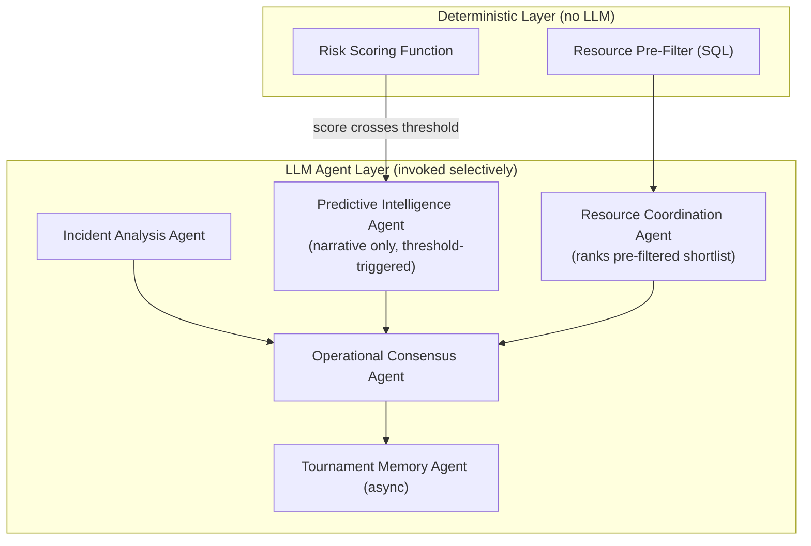

# StadiumPulse

Event-driven, multi-agent stadium operations platform. Five specialized
agents propose, negotiate, and explain resource and incident decisions in
real time — visible agent disagreement and resolution, not a black-box
pipeline dressed up as "AI."

## Quickstart

```bash
cp .env.example .env        # fill in ANTHROPIC_API_KEY at minimum
docker compose up --build
```

- Backend API: http://localhost:8000/api/v1/docs
- Frontend: http://localhost:3000
- Health check: http://localhost:8000/health

That's it — Postgres (with pgvector), Redis, the backend, and the frontend
all come up together with healthchecks gating startup order.

## Architecture



Design rationale for the two biggest architectural calls is recorded in
[`docs/decisions/`](./docs/decisions/):

- [0001 — Deterministic risk scoring, LLM for narrative only](./docs/decisions/0001-deterministic-risk-scoring.md)
- [0002 — Resource Coordination Agent proposes, Dispatch Service executes](./docs/decisions/0002-agent-ownership-boundary.md)
- [0003 — LLMClient lives in `core/`, shared by every agent](./docs/decisions/0003-llm-client-abstraction.md)
- [0004 — Risk score current-value cache in Redis, history in Postgres](./docs/decisions/0004-risk-score-cache-strategy.md)

## Tech stack

| Layer | Choice |
|---|---|
| Backend | Python 3.11, FastAPI, SQLAlchemy (async), Alembic |
| Database | PostgreSQL 16 + pgvector |
| Cache / Event Bus | Redis (pub/sub) |
| LLM | Anthropic Claude, behind a provider-agnostic `LLMClient` interface |
| Frontend | Next.js 15, React 18, TypeScript, Tailwind CSS |
| Orchestration | Docker Compose |

## Repository structure

```
stadiumpulse/
├── backend/
│   ├── app/
│   │   ├── main.py              # FastAPI composition root
│   │   ├── core/                 # config, DI container, LLM client, events, logging, errors
│   │   ├── api/v1/                # versioned API routers
│   │   ├── agents/                # agent modules (added incrementally)
│   │   └── db/                    # SQLAlchemy engine/session bootstrap
│   ├── tests/
│   └── Dockerfile
├── frontend/
│   ├── src/
│   │   ├── app/                   # Next.js App Router pages
│   │   ├── lib/                   # api client, runtime config
│   │   └── types/                 # shared TS contracts (mirrors backend events)
│   └── Dockerfile
├── docs/decisions/                # Architecture Decision Records
└── docker-compose.yml
```

## Local development without Docker

**Backend**
```bash
cd backend
python -m venv .venv && source .venv/bin/activate
pip install -r requirements.txt
cp .env.example .env
uvicorn app.main:app --reload
```

**Frontend**
```bash
cd frontend
npm install
cp .env.example .env.local
npm run dev
```

## Database

Schema lives entirely in `backend/app/db/models/` (SQLAlchemy 2.0 ORM,
async) with migrations in `backend/migrations/`. Run migrations against a
live Postgres (e.g. the `docker compose` instance):

```bash
cd backend
alembic upgrade head
python -m app.db.seed   # optional: creates a demo venue/zones/users/resources
```

Entity overview:

| Table | Owner / write path |
|---|---|
| `venues`, `zones` | Foundational; written by admin setup |
| `users` | Auth module |
| `resources` | Roster; status updated by volunteers (own record only) and Dispatch Service |
| `incidents` | Incident Analysis Agent (creation), status transitions by Dispatch/Admin |
| `negotiations` | Operational Consensus Agent — one row per Proposal/Challenge/Rebuttal/Resolution turn |
| `resource_assignments` | **Dispatch Service only** — see [ADR-0002](./docs/decisions/0002-agent-ownership-boundary.md) |
| `risk_scores` | Deterministic scorer (history); current value cached in Redis, see [ADR-0004](./docs/decisions/0004-risk-score-cache-strategy.md) |
| `tournament_memory` | Tournament Memory Agent, async after incident resolution; pgvector cosine similarity search |

## Testing

```bash
cd backend
pytest tests/ -v
```

```bash
cd frontend
npm run type-check
npm run build
```

## Status

**Completed modules:**
1. Foundation — repository scaffolding, Docker orchestration, shared
   backend configuration/DI/LLM-client/event contracts, minimal frontend shell.
2. Database — full schema (9 tables), Alembic migrations, pgvector-backed
   Tournament Memory, seed data.

**Not yet implemented:** agent logic, API domain routers (incidents,
resources, risk, memory), the dashboard UI, and authentication middleware.
These are built as subsequent, individually-approved modules.

## License

MIT — see [`LICENSE`](./LICENSE).
